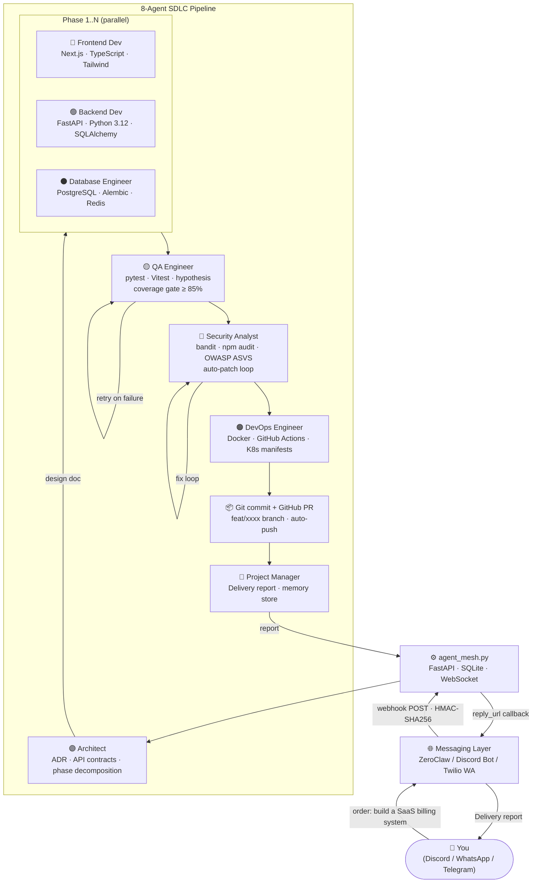

# CoDevx — Agent Mesh v4.0

> **A production-grade, 8-agent AI software development team** that takes a plain-English task description and delivers a working, tested, and committed codebase — complete with architecture docs, frontend, backend, database migrations, test suites, security scan, CI/CD configuration, and a GitHub PR.

---

## Table of Contents

1. [What is this?](#what-is-this)
2. [How it works](#how-it-works)
3. [Agent Squad](#agent-squad)
4. [Architecture](#architecture)
5. [Prerequisites](#prerequisites)
6. [Quick Start (local dev)](#quick-start-local-dev)
7. [IDE Integration (VS Code · Cursor · Antigravity)](#ide-integration-vs-code--cursor--antigravity)
   - [IDE Chatbot Tools — agents consult Copilot, Cursor, Antigravity](#ide-chatbot-tools--agents-consult-copilot-cursor-antigravity)
8. [Docker Deployment](#docker-deployment)
9. [Messaging Provider Setup](#messaging-provider-setup)
   - [Discord](#discord)
   - [WhatsApp via Twilio](#whatsapp-via-twilio)
   - [ZeroClaw (all channels)](#zeroclaw-all-channels-unified-gateway)
10. [LLM Configuration](#llm-configuration)
11. [Configuration Reference](#configuration-reference)
12. [The SDLC Pipeline](#the-sdlc-pipeline)
13. [Pipeline v4.0 — Production Features](#pipeline-v40--production-features)
14. [Command Center UI](#command-center-ui)
15. [Project Structure](#project-structure)
16. [Development Guide](#development-guide)

---

## What is this?

**CoDevx** is an autonomous software development infrastructure powered by eight specialized AI agents collaborating through a structured SDLC (Software Development Life Cycle) pipeline.

You give it an order: _"Build a multi-tenant SaaS billing system with Stripe integration"_ via Discord, WhatsApp, Telegram, or any other messaging platform. The system:

1. **Designs** the full architecture
2. **Breaks** the work into implementation phases
3. **Writes** production-grade frontend (React + TypeScript) and backend (FastAPI + Python) code **in parallel**
4. **Writes** database migrations with proper indexes, RLS policies, and soft deletes
5. **Writes** a full test suite and **actually runs it** (pytest + vitest)
6. **Runs a real security scan** (bandit + npm audit), applies fixes if needed, re-scans
7. **Generates CI/CD** (GitHub Actions + Dockerfile + docker-compose)
8. **Commits** to a feature branch and opens a **GitHub Pull Request**
9. **Delivers a delivery report** over your messaging channel
10. **Remembers** what it built, injecting relevant context into future tasks

All of this happens autonomously. You only approve the architecture plan before execution begins.

---

## How it works



---

## Agent Squad

| Agent | Role | Key Standards |
|-------|------|---------------|
| **Architect** | System design, API contracts, data models, dependency selection | Architecture doc format, security design, scalability |
| **Frontend Dev** | React 19 / TypeScript / Tailwind UI | Named exports, Zod validation, React Query, aria-labels, no `any` |
| **Backend Dev** | FastAPI / Python 3.12 APIs | Parameterized SQL, JWT auth, rate limiting, structlog, no bare exceptions |
| **Database Engineer** | PostgreSQL / SQLite / Redis schemas | Idempotent DDL, soft deletes, RLS, indexes on all FKs |
| **QA Engineer** | pytest + Vitest test suites | ≥85% branch coverage, mocked externals, integration tests |
| **Security Analyst** | OWASP Top 10 review + tool scan | bandit + npm audit, SCAN: PASSED/FAILED verdict, auto-patches |
| **DevOps Engineer** | Docker + GitHub Actions CI/CD | Multi-stage builds, pinned versions, health checks, resource limits |
| **Project Manager** | Orchestration + delivery reports | Phase planning, memory storage, structured stakeholder report |

---

## Architecture

```
d:\Projects\AI-DEV-TEAM\
├── agent_mesh.py              FastAPI backend — the heart of the system
├── requirements.txt           Python 3.12 dependencies
├── Dockerfile                 Backend container (Python 3.12-slim)
├── docker-compose.yml         Multi-container: backend + React UI + nginx
├── .env.example               → copy to .env and fill in your credentials
├── zeroclaw_squad.yaml        Team configuration — agents, pipeline, storage
│
├── command-center/            React 19 + TypeScript + Tailwind PWA
│   ├── src/
│   │   ├── pages/             Dashboard, Agents, Logs, History, Settings
│   │   ├── components/        AgentGrid, TerminalLogs, TaskHistory, Header
│   │   ├── hooks/             useAgentState (WebSocket + auto-reconnect)
│   │   └── types/index.ts     Shared TypeScript types
│   ├── public/manifest.json   PWA metadata (installable on Android)
│   ├── public/sw.js           Service worker (offline support)
│   ├── nginx.conf             Reverse proxy → backend:8000
│   └── Dockerfile             Multi-stage: Node build → Nginx serve
│
└── docs/
    ├── zeroclaw/
    │   ├── config.toml.example    ZeroClaw gateway configuration template
    │   └── sop.yaml.example       ZeroClaw SOP webhook templates
    └── architecture.md            Extended architecture notes
```

**Data flow:**
- Backend runs on port **8000** (FastAPI + uvicorn)
- React dev server runs on port **5173** (Vite HMR, proxies `/api` + `/ws` → 8000)
- React production build served by Nginx on port **3000** (Docker)
- WebSocket `ws://host:8000/ws/state` pushes real-time agent status to all UI clients
- SQLite at `./agent_mesh.db` stores logs, task history, generated files, and agent memory

---

## Prerequisites

| Requirement | Version | Notes |
|-------------|---------|-------|
| Python | 3.12+ | `python --version` |
| Node.js | 18+ | `node --version` |
| Git | 2.x | Must be on `PATH` for auto-commit |
| Docker + Docker Compose | 24+ | Optional — for containerized deployment |
| OpenAI API key | — | Optional — pipeline works in simulation mode without one |
| Discord Bot token | — | Optional — for Discord messaging |
| Twilio account | — | Optional — for WhatsApp messaging |
| ZeroClaw daemon | latest | Optional — for unified multi-channel messaging |

---

## Quick Start (local dev)

### 1. Clone and configure

```bash
git clone https://github.com/InZights/CoDevx.git
cd CoDevx
cp .env.example .env
# Edit .env — fill in at minimum OPENAI_API_KEY and one messaging provider
```

### 2. Install Python dependencies

```bash
pip install -r requirements.txt
# For real tool execution (ENABLE_REAL_TOOLS=true):
pip install pytest pytest-cov pytest-asyncio bandit
```

### 3. Start the backend

```bash
python agent_mesh.py
# Server starts at http://localhost:8000
# WebSocket at ws://localhost:8000/ws/state
```

### 4. Start the React Command Center

```bash
cd command-center
npm install
npm run dev
# UI available at http://localhost:5173
```

### 5. Send your first order

Via Discord: `!order Build a REST API for a todo list app`  
Via WhatsApp: `order Build a REST API for a todo list app`  
Via REST API: `POST http://localhost:8000/api/order`  
```json
{ "task": "Build a REST API for a todo list app" }
```

The pipeline starts. Watch agents activate in the Command Center UI. Receive the delivery report with your PR link.

---

## IDE Integration (VS Code · Cursor · Antigravity)

CoDevx exposes an **MCP (Model Context Protocol) server** at `http://localhost:8000/mcp`, letting VS Code Copilot, Cursor AI, and Google Antigravity invoke the full 8-agent pipeline directly from their chat/agent panels — no Discord or WhatsApp required.

### Available MCP Tools

| Tool | Parameters | Description |
|------|-----------|-------------|
| `codevx_submit_order` | `task: str` | Submit a task — starts the full SDLC pipeline |
| `codevx_get_state` | — | All agent statuses + active task |
| `codevx_get_history` | — | Completed tasks with files, branch, PR URL |
| `codevx_get_logs` | `limit?: int` | Recent pipeline activity logs |
| `codevx_get_agent` | `name: str` | Status of a specific agent |

### VS Code (GitHub Copilot)

Copilot auto-reads `.github/copilot-instructions.md` for workspace context. To enable MCP tool calling, add the CoDevx server to your `.vscode/settings.json`:

```json
{
  "mcp": {
    "servers": {
      "codevx": {
        "type": "http",
        "url": "http://localhost:8000/mcp"
      }
    }
  }
}
```

Then in Copilot Chat:
> _"Submit an order to CoDevx: build a Stripe billing integration with webhook support"_

### Cursor AI

Cursor auto-discovers MCP servers via `.mcp.json` at the project root (already included). The `.cursor/rules/codevx.mdc` file is loaded with `alwaysApply: true`, giving Cursor full project context.

In Cursor Composer or Chat:
> _"Use the CoDevx MCP tool to submit an order: add OAuth2 Google login"_

### Google Antigravity

Antigravity is a standalone AI IDE (desktop app) that supports MCP servers. Connect CoDevx to Antigravity in two steps:

1. Open Antigravity → `...` menu in the side panel → **Manage MCP Servers** → **View raw config**
2. Paste the contents of `config/antigravity_mcp_config.json` into the config editor and save.

Antigravity will then have access to all CoDevx MCP tools (`codevx_submit_order`, `codevx_get_state`, etc.) directly from its Agent panel:
> _“Use codevx_submit_order to build a real-time collaborative whiteboard”_

Antigravity runs **Gemini 3.1 Pro, Claude Sonnet 4.6, GPT-OSS-120b** as its reasoning models. If you set `IDE_CHATBOT=antigravity` and `GOOGLE_API_KEY`, CoDevx agents will additionally consult Gemini (the same model Antigravity uses) at key pipeline stages.

### IDE integration files at a glance

| File | Read by | Purpose |
|------|---------|--------|
| `.mcp.json` | Cursor | MCP server auto-discovery |
| `config/antigravity_mcp_config.json` | **Google Antigravity** | Paste into Antigravity → Manage MCP Servers → View raw config |
| `.github/copilot-instructions.md` | VS Code Copilot | Workspace instructions + code standards |
| `.cursor/rules/codevx.mdc` | Cursor AI | Project rules (`alwaysApply: true`) |
| `AGENTS.md` | All AI-native IDEs | Universal agent manifest |

---

### IDE Integration — Use CoDevx from VS Code, Cursor, or Antigravity

CoDevx is IDE-agnostic. Whether your team works in **VS Code** (GitHub Copilot), **Cursor AI**, or **Google Antigravity**, you can invoke the full 8-agent pipeline directly from your IDE chat — no browser, no separate dashboard required.

```
  ┌──────────────────────┐     ┌──────────────────────┐     ┌──────────────────────┐
  │   VS Code            │     │   Cursor AI           │     │  Google Antigravity  │
  │   + GitHub Copilot   │     │   (built-in chat)     │     │  (Gemini)            │
  └──────────┬───────────┘     └──────────┬────────────┘     └──────────┬───────────┘
             │  MCP (SSE)                 │  MCP (SSE)                  │  MCP (SSE)
             └────────────────────────────┼─────────────────────────┘
                                          ▼
                          ┌───────────────────────────────┐
                          │   agent_mesh.py               │
                          │   http://localhost:8000/mcp   │
                          │                               │
                          │   PM → Architect → DB →       │
                          │   Backend → Frontend →        │
                          │   QA → Security → DevOps      │
                          └───────────────────────────────┘
```

**Each IDE connects the same way — via the MCP server:**

| IDE | How to connect |
|-----|---------------|
| **VS Code + GitHub Copilot** | Add `http://localhost:8000/mcp` to VS Code MCP settings (`.mcp.json` already included) |
| **Cursor AI** | Add the MCP server URL in Cursor → Settings → MCP → add server |
| **Google Antigravity** | Paste `config/antigravity_mcp_config.json` into the Antigravity MCP store |

Once connected, use natural language in any of these IDEs to trigger the pipeline:

> _"Submit an order to CoDevx: build a REST API for user authentication with JWT tokens"_

**VS Code bridge (optional — routes Copilot as the agents' LLM brain):**

The `codevx-vscode-bridge` VS Code extension is an optional component that lets you use **GitHub Copilot's models as the LLM brain** for the agents (instead of OpenAI/Anthropic/Gemini directly). This is separate from the MCP connection — you don't need the bridge just to invoke CoDevx from VS Code.

1. **Install the bridge extension** from the `codevx-vscode-bridge/` folder:
   ```bash
   cd codevx-vscode-bridge
   npm install
   npm run compile
   npx vsce package
   code --install-extension codevx-vscode-bridge-1.0.0.vsix
   ```

2. **Verify the bridge is running** — a `CoDevx Bridge :8001` item appears in the VS Code status bar.

3. **Set the LLM provider to Copilot** in your `.env`:
   ```env
   LLM_PROVIDER=copilot
   COPILOT_BRIDGE_URL=http://localhost:8001
   ```
**LLM brain configuration** (independent of IDE tools):

| Setting | Effect |
|---------|--------|
| `LLM_PROVIDER=openai` | Default — agents use OpenAI API as brain |
| `LLM_PROVIDER=copilot` | Agents use GitHub Copilot as brain (all LLM calls routed through bridge) |
| `LLM_PROVIDER=cursor` | Agents use Cursor AI as brain (same bridge protocol) |
| `LLM_PROVIDER=simulate` | No LLM calls — useful for CI/CD pipeline testing |

**Bridge HTTP API** (used internally by `agent_mesh.py`):

| Endpoint | Method | Description |
|----------|--------|-------------|
| `/health` | GET | Bridge status, capabilities, available Copilot models |
| `/models` | GET | All models detected by `vscode.lm` |
| `/chat` | POST | `{agent, system, user, model?, ide?, include_workspace?}` → `{content, model, vendor, ide}` |
| `/workspace-context` | GET | Currently open VS Code files (path, language, 120-line preview) |

---

## Docker Deployment

### Full stack (recommended)

```bash
cp .env.example .env
# Edit .env with your credentials

docker compose up --build
```

Services:
- **Backend** → `http://localhost:8000`
- **Command Center** → `http://localhost:3000`

### Backend only

```bash
docker build -t codevx-backend .
docker run -p 8000:8000 --env-file .env codevx-backend
```

### Production considerations

```yaml
# docker-compose.yml — add these for production:
services:
  agent-mesh:
    restart: unless-stopped
    deploy:
      resources:
        limits:
          memory: 512m
    healthcheck:
      test: ["CMD", "curl", "-f", "http://localhost:8000/health"]
      interval: 30s
      timeout: 10s
      retries: 3
```

---

## Messaging Provider Setup

Set `MESSAGING_PROVIDER` in `.env` to choose your channel:

| Value | Channels |
|-------|----------|
| `discord` | Discord server channels |
| `whatsapp` | WhatsApp via Twilio |
| `both` | Discord + WhatsApp simultaneously |
| `zeroclaw` | All channels via ZeroClaw gateway |

### Discord

1. Go to [discord.com/developers](https://discord.com/developers) → **New Application** → **Bot**
2. Enable **Message Content Intent** under Privileged Gateway Intents
3. Copy the **Bot Token** → set `DISCORD_TOKEN` in `.env`
4. Invite bot to server: OAuth2 → URL Generator → `bot` scope + `Send Messages`, `Read Messages` permissions
5. Create 4 channels in your server:
   - `#orders` — where you send `!order <task>`
   - `#plans` — where the Architect posts the plan (approve with ✅, reject with ❌)
   - `#activity-log` — live pipeline logs
   - `#reports` — delivery reports
6. Copy channel IDs (right-click channel → Copy ID — requires Developer Mode)
7. Set `CH_ORDERS`, `CH_PLANS`, `CH_LOGS`, `CH_REPORTS`, `MANAGER_DISCORD_ID` in `.env`

### WhatsApp via Twilio

1. Create a [Twilio](https://www.twilio.com) account
2. Enable the WhatsApp Sandbox (Messaging → Try it Out → Send a WhatsApp Message)
3. Set env vars: `TWILIO_ACCOUNT_SID`, `TWILIO_AUTH_TOKEN`, `TWILIO_WHATSAPP_FROM`, `MANAGER_WHATSAPP`
4. Expose your backend with ngrok: `ngrok http 8000`
5. In Twilio sandbox settings, set the webhook URL to: `https://<ngrok-id>.ngrok.io/webhook/whatsapp`
6. Send `!order <task>` to your Twilio WhatsApp number

### ZeroClaw (All Channels — Unified Gateway)

> ZeroClaw is a **Rust-native AI assistant daemon** (~8.8 MB binary, <5 MB RAM) that manages Discord, WhatsApp, Telegram, Slack, Signal, iMessage, Matrix, IRC, Email, Bluesky, and 20+ more channels from a single process. When `MESSAGING_PROVIDER=zeroclaw`, agent_mesh no longer runs discord.py or Twilio directly — ZeroClaw handles all channel I/O and calls the agent_mesh webhook.

**What ZeroClaw IS:**
- Single Rust binary that manages all messaging channels
- SOP (Standard Operating Procedure) webhook automation
- HMAC-SHA256 security between ZeroClaw and agent_mesh
- Pairing, sandboxing, approval gating, rate limiting
- Web dashboard at port 42617

**What ZeroClaw is NOT:**
- A Python library (cannot `pip install`) — install via the installer script
- A replacement for the SDLC pipeline (it's the channel/security layer)

**Setup:**

```bash
# 1. Install ZeroClaw
curl -fsSL https://zeroclawlabs.ai/install.sh | bash

# 2. Onboard (interactive — connects your channels)
zeroclaw onboard

# 3. Copy the configuration templates from docs/zeroclaw/
cp docs/zeroclaw/config.toml.example ~/.zeroclaw/config.toml
cp docs/zeroclaw/sop.yaml.example ~/.zeroclaw/workspace/sops/ai-devteam.yaml
# Edit both files with your credentials

# 4. Start the ZeroClaw daemon
zeroclaw daemon

# 5. Update .env
# MESSAGING_PROVIDER=zeroclaw
# ZEROCLAW_GATEWAY_URL=http://localhost:42617
# ZEROCLAW_WEBHOOK_SECRET=<generate: python -c "import secrets; print(secrets.token_hex(32))">
```

**Security:** Every POST from ZeroClaw to `/webhook/zeroclaw` is HMAC-SHA256 signed. The same secret must be set in both `.env` (`ZEROCLAW_WEBHOOK_SECRET`) and `~/.zeroclaw/config.toml`.

---

## LLM Configuration

CoDevx uses **[LiteLLM](https://github.com/BerriAI/litellm)** as a universal LLM router. Set `LLM_MODEL` in `.env` and CoDevx automatically routes to the right provider — no code changes needed.

```env
# The single knob to switch your agents' brain:
LLM_MODEL=gpt-4o               # ← change this to any model below
```

### Supported providers

| Provider | `LLM_MODEL` example | Key variable |
|----------|--------------------|--------------|
| **OpenAI** | `gpt-4o` `gpt-4.1` `o3-mini` | `OPENAI_API_KEY` |
| **Anthropic Claude** | `claude-opus-4` `claude-sonnet-4` `claude-haiku-3-5` | `ANTHROPIC_API_KEY` |
| **Google Gemini** | `gemini/gemini-2.5-pro` `gemini/gemini-3-flash` | `GOOGLE_API_KEY` |
| **Groq** _(fast)_ | `groq/llama-3.3-70b` `groq/mixtral-8x7b` | `GROQ_API_KEY` |
| **Mistral AI** | `mistral/mistral-large` `mistral/codestral` | `MISTRAL_API_KEY` |
| **Together AI** | `together_ai/meta-llama/Llama-3-70b-Instruct` | `TOGETHERAI_API_KEY` |
| **Ollama** _(local, free)_ | `ollama/llama3.3` `ollama/qwen2.5-coder:32b` | none (just `ollama serve`) |
| **LM Studio** _(local, free)_ | `openai/local-model` + `OPENAI_BASE_URL` | none |
| **AWS Bedrock** | `bedrock/anthropic.claude-3-5-sonnet-20241022` | `AWS_*` vars |
| **Azure OpenAI** | `azure/<deployment>` + `OPENAI_BASE_URL` | `OPENAI_API_KEY` |
| **Any OpenAI-compatible** | `openai/<model>` + `OPENAI_BASE_URL` | `OPENAI_API_KEY` |

### Quick switch examples

```env
# Switch to Claude Opus 4 (Anthropic)
LLM_MODEL=claude-opus-4
ANTHROPIC_API_KEY=sk-ant-...

# Switch to Gemini 2.5 Pro (Google)
LLM_MODEL=gemini/gemini-2.5-pro
GOOGLE_API_KEY=AIza...

# Switch to Llama 3.3 on Groq (fastest inference)
LLM_MODEL=groq/llama-3.3-70b
GROQ_API_KEY=gsk_...

# Run fully local with Ollama (no API key, no cost)
LLM_MODEL=ollama/qwen2.5-coder:32b
OLLAMA_HOST=http://localhost:11434
```

No API key configured? The pipeline runs in **simulation mode** — all pipeline stages execute and files are generated with placeholder content, so you can test the full SDLC flow without spending tokens.

---

## Configuration Reference

Copy `.env.example` to `.env` and configure:

### Core

| Variable | Default | Description |
|----------|---------|-------------|
| `MESSAGING_PROVIDER` | `discord` | `discord` \| `whatsapp` \| `both` \| `zeroclaw` |
| `LLM_MODEL` | `gpt-4o` | The agents' LLM brain — any LiteLLM-supported model string |
| `OPENAI_API_KEY` | — | OpenAI API key (or Azure / OpenAI-compatible) |
| `ANTHROPIC_API_KEY` | — | Anthropic Claude API key |
| `GOOGLE_API_KEY` | — | Google Gemini API key (also used for Antigravity IDE consultation) |
| `GROQ_API_KEY` | — | Groq API key |
| `MISTRAL_API_KEY` | — | Mistral AI API key |
| `TOGETHERAI_API_KEY` | — | Together AI API key |
| `OLLAMA_HOST` | `http://localhost:11434` | Ollama server URL for local models |
| `OPENAI_BASE_URL` | — | Override for Azure / LM Studio / any OpenAI-compatible endpoint |
| `DB_PATH` | `./agent_mesh.db` | SQLite database path |
| `GIT_WORKSPACE` | `./workspace` | Directory agents write code to |

### Discord

| Variable | Description |
|----------|-------------|
| `DISCORD_TOKEN` | Bot token from Discord Developer Portal |
| `MANAGER_DISCORD_ID` | Your Discord user ID (approve/reject gating) |
| `CH_ORDERS` | Channel ID for `!order` commands |
| `CH_PLANS` | Channel ID for plan approval |
| `CH_LOGS` | Channel ID for activity logs |
| `CH_REPORTS` | Channel ID for delivery reports |

### WhatsApp / Twilio

| Variable | Description |
|----------|-------------|
| `TWILIO_ACCOUNT_SID` | Twilio Account SID |
| `TWILIO_AUTH_TOKEN` | Twilio Auth Token |
| `TWILIO_WHATSAPP_FROM` | Your Twilio WhatsApp number (`whatsapp:+1...`) |
| `MANAGER_WHATSAPP` | Your personal WhatsApp number (approvals) |

### GitHub

| Variable | Description |
|----------|-------------|
| `GITHUB_TOKEN` | Personal access token (repo scope) - enables auto PR |
| `GITHUB_REPO` | `owner/repo` format |
| `GIT_USER_NAME` | Git commit author name |
| `GIT_USER_EMAIL` | Git commit author email |

### ZeroClaw

| Variable | Default | Description |
|----------|---------|-------------|
| `ZEROCLAW_GATEWAY_URL` | `http://localhost:42617` | ZeroClaw daemon URL |
| `ZEROCLAW_WEBHOOK_SECRET` | — | HMAC-SHA256 shared secret |

### IDE / MCP

| Variable | Default | Description |
|----------|---------|-------------|
| `MCP_ENABLED` | `true` | Enable `/mcp` endpoint for IDE integration |
| `LLM_PROVIDER` | `openai` | `openai` \| `copilot` \| `cursor` \| `simulate` — used to route brain through VS Code Copilot |
| `COPILOT_BRIDGE_URL` | `http://localhost:8001` | URL of the codevx-vscode-bridge extension |
| `IDE_TOOLS_ENABLED` | `false` | Agents consult IDE chatbots as supplementary tools |
| `IDE_CHATBOT` | `copilot` | `copilot` \| `cursor` \| `antigravity` \| `all` — which chatbot(s) to consult |
| `ANTIGRAVITY_MODEL` | `gemini/gemini-2.5-pro` | Gemini model used when consulting Antigravity (via `GOOGLE_API_KEY`) |

### Pipeline Tuning (v4.0)

| Variable | Default | Description |
|----------|---------|-------------|
| `OPENAI_MAX_TOKENS` | `4000` | Max tokens per agent LLM call |
| `MAX_RETRIES` | `2` | QA / Security gate retry attempts |
| `MAX_SUBTASKS` | `5` | Max implementation phases from task decomposition |
| `ENABLE_REAL_TOOLS` | `true` | Run pytest, bandit, npm audit during pipeline |
| `DOCKER_BUILD` | `false` | Docker build after DevOps generates Dockerfile |
| `MEMORY_CONTEXT_K` | `5` | Past agent memories injected into each Architect call |

---

## The SDLC Pipeline

Every task runs through 8 agents in a structured sequence:

```
1. Memory Recall
   └── Retrieve relevant past builds from agent_memory table (keyword search)

2. Architect (1x)
   └── Full system design: files, APIs, data models, security design, dependencies
   └── Context: past memories injected here

3. Task Decomposition
   └── Simple tasks → single phase
   └── Complex tasks → up to MAX_SUBTASKS ordered phases (LLM decides)

4. Per-Phase Loop [Frontend Dev + Backend Dev + Database Engineer]
   ├── Frontend Dev     (React 19 / TypeScript / Tailwind)   ─ parallel
   ├── Backend Dev      (FastAPI / Python 3.12)               ─ parallel
   └── Database Engineer (migrations, indexes, RLS)

   → Files written to GIT_WORKSPACE immediately after each agent

5. QA Gate (with retry loop, up to MAX_RETRIES)
   ├── QA Engineer writes test suites (pytest + Vitest)
   ├── ENABLE_REAL_TOOLS=true → runs: pytest --cov + npm test
   ├── Checks: coverage ≥ 80%, no test failures
   └── If fails → regenerate tests and re-run (up to MAX_RETRIES times)

6. Security Gate (with fix loop, up to MAX_RETRIES)
   ├── Security Analyst LLM review (OWASP Top 10)
   ├── ENABLE_REAL_TOOLS=true → runs: bandit + npm audit
   ├── If SCAN: FAILED → extract fix files, apply, re-scan
   └── If still failing after all retries → pipeline aborts with error

7. DevOps Engineer
   ├── Generates: Dockerfile, docker-compose.yml, .github/workflows/ci.yml, Makefile
   └── DOCKER_BUILD=true → actually runs `docker build`

8. Git Commit + GitHub PR
   └── Writes all files, commits to feat/<task-id>, pushes, opens PR

9. Project Manager
   ├── Compiles delivery report (phases, files, coverage, security, PR URL)
   └── Sends report back to you via your messaging channel

10. Memory Store
    └── Saves Architect design, Backend patterns, Security findings, PM summary
        to agent_memory table for future task context
```

---

## Pipeline v4.0 — Production Features

### Real Tool Execution

Unlike v3.0 which only asked the LLM to *imagine* it scanned code, v4.0 actually executes tools:

```
ENABLE_REAL_TOOLS=true (default)

QA:
  Python projects  → python -m pytest --tb=short -q --cov=. --cov-report=term-missing
  JS/TS projects   → npm test -- --run --reporter=verbose

Security:
  Python code      → python -m bandit -r . -ll -f txt --exit-zero
  npm packages     → npm audit --audit-level=high --json
```

Requires the tools to be installed:
```bash
pip install pytest pytest-cov pytest-asyncio bandit
# npm is already available if Node.js is installed
```

### Agent Memory (Cross-Task Learning)

After every completed task, 4 types of knowledge are stored:

```
task_id | agent            | category     | content
--------|------------------|--------------|--------
abc123  | Architect        | architecture | "Multi-tenant SaaS: use tenant_id FK..."
abc123  | Backend Dev      | patterns     | "JWT auth via python-jose, rate limiting..."
abc123  | Security Analyst | findings     | "MEDIUM: missing rate limit on /auth/login"
abc123  | Project Manager  | delivery     | "Built billing system in 3 phases..."
```

At the start of every new task, relevant memories (keyword-matched) are injected into the Architect's context. The system gets smarter with each task.

### Iterative QA Retry

```
Write tests → Run pytest/vitest → coverage < 80% or failures?
    → YES: Regenerate tests with failure context → retry (up to MAX_RETRIES)
    → NO:  Pass gate, continue
```

### Iterative Security Fix Loop

```
LLM review → bandit + npm audit → SCAN: FAILED?
    → YES: Extract fix files from LLM → write to workspace → re-scan (up to MAX_RETRIES)
    → NO:  Pass gate (or hard abort if all retries exhausted)
```

---

## Command Center UI

The React PWA provides a real-time dashboard for monitoring the pipeline.

**Access:**
- Local dev: `http://localhost:5173`
- Docker: `http://localhost:3000`
- Mobile: use your machine's LAN IP (Settings page → Backend URL field)

**Pages:**
| Page | Description |
|------|-------------|
| Dashboard | Active task, 8-agent status grid, live terminal logs |
| Agents | Per-agent detailed view with status badges |
| Logs | Full terminal log with text search |
| History | Completed tasks: files generated, PR URL, branch, test pass count |
| Settings | Configuration overview, messaging status, pipeline engine settings |

**PWA Installation (Android/iOS):**
1. Open Chrome/Safari → navigate to the Command Center URL
2. Chrome → ⋮ menu → **Add to Home Screen**
3. The app installs as "CmdCenter" with native app feel

**WebSocket auto-reconnect:** The UI reconnects automatically if the backend restarts or network drops. No manual refresh needed.

---

## Project Structure

```
AI-DEV-TEAM/
│
├── agent_mesh.py              # FastAPI backend + MCP server (single-file by design)
├── requirements.txt           # Python dependencies
├── Dockerfile                 # Backend container image
├── docker-compose.yml         # Full-stack orchestration
├── .env.example               # Environment variable template → copy to .env
├── .gitignore
├── zeroclaw_squad.yaml        # Team/agent/pipeline configuration
├── .mcp.json                  # MCP server discovery (Cursor / VS Code)
├── AGENTS.md                  # Universal agent manifest (all AI-native IDEs)
├── LICENSE
│
├── config/                    # IDE and tool configuration files
│   └── antigravity_mcp_config.json  # Paste into Antigravity MCP store
│
├── scripts/                   # Development and maintenance scripts
│   └── patches/               # One-shot patch scripts (historical reference)
│       ├── _patch_mcp.py
│       ├── _patch_llm_provider.py
│       ├── _patch_ide_tools.py
│       ├── _patch_multillm.py
│       ├── _patch_langgraph.py
│       └── _patch_wa_hitl.py
│
├── command-center/            # React 19 + TypeScript + Tailwind PWA dashboard
│   ├── Dockerfile             # Multi-stage: Node build → Nginx
│   ├── nginx.conf             # Reverse proxy to backend
│   ├── package.json
│   ├── vite.config.ts
│   ├── tailwind.config.ts
│   ├── public/
│   │   ├── manifest.json      # PWA metadata
│   │   └── sw.js              # Service worker (offline)
│   └── src/
│       ├── App.tsx
│       ├── main.tsx
│       ├── components/        # AgentCard, AgentGrid, Header, Sidebar, …
│       ├── pages/             # Dashboard, AgentsPage, LogsPage, …
│       ├── hooks/
│       │   └── useAgentState.ts   # WebSocket + state management
│       ├── types/index.ts         # Shared TypeScript types
│       └── utils/colors.ts
│
├── codevx-vscode-bridge/      # VS Code extension — HTTP bridge → GitHub Copilot
│   └── src/extension.ts
│
├── docs/                      # Extended documentation
│   ├── architecture.md        # Architecture Decision Records, API contracts, DB schema
│   └── zeroclaw/
        ├── config.toml.example    # ZeroClaw gateway config template
        └── sop.yaml.example       # ZeroClaw SOP webhook templates
```

---

## Development Guide

### Running the backend with hot-reload

```bash
uvicorn agent_mesh:app --reload --port 8000
```

### Running tests

```bash
# Backend
pip install pytest pytest-asyncio pytest-cov httpx
pytest --tb=short -q

# Frontend
cd command-center && npm test
```

### TypeScript type check

```bash
cd command-center && npx tsc --noEmit
```

### Building for production

```bash
# React UI
cd command-center && npm run build
# Output: command-center/dist/  (served by Nginx in Docker)
```

### Linting

```bash
# Python
pip install ruff
ruff check agent_mesh.py

# TypeScript
cd command-center && npm run lint
```

### Database inspection

```bash
sqlite3 agent_mesh.db
.tables          # logs, task_history, generated_files, agent_memory
.schema agent_memory
SELECT * FROM task_history ORDER BY id DESC LIMIT 5;
```

### Resetting agent memory

```bash
sqlite3 agent_mesh.db "DELETE FROM agent_memory;"
```

### Simulated pipeline (no API key needed)

Run without `OPENAI_API_KEY` — all agents produce placeholder files. The full pipeline runs end-to-end including git commit, so you can test the entire flow without spending LLM credits.

### Environment variables priority

1. `.env` file (loaded by python-dotenv on startup)
2. Actual shell environment variables (override `.env`)

---

## Security Notes

- **HMAC-SHA256** validates every ZeroClaw webhook POST — set `ZEROCLAW_WEBHOOK_SECRET` to a 64-char random hex string
- **Approval gating** — the Architect's plan must be explicitly approved before the pipeline runs
- **Parameterized SQL** — all database queries use aiosqlite parameterized statements (no injection risk)
- **No shell=True** — all subprocesses use `asyncio.create_subprocess_exec` (injection-safe)
- **Input validation** — all webhook request bodies are validated via Pydantic v2 models
- **GITHUB_TOKEN scope** — use `repo` scope only; never store in code, always in `.env`

---

## Troubleshooting

| Problem | Solution |
|---------|----------|
| `OPENAI_API_KEY not set` | Set key in `.env` — pipeline runs in simulation mode without it |
| `Discord bot offline` | Check `DISCORD_TOKEN`, ensure bot has Message Content Intent enabled |
| `git push failed` | Set `GITHUB_TOKEN` and `GITHUB_REPO` in `.env` for push/PR support |
| `bandit: command not found` | `pip install bandit` or set `ENABLE_REAL_TOOLS=false` |
| `pytest: no tests found` | QA gate still passes — no tests counted as "no runner detected" |
| `Memory recall empty` | Expected on first task — memories accumulate with each completed pipeline |
| `ZeroClaw webhook 401` | `ZEROCLAW_WEBHOOK_SECRET` mismatch between daemon config and `.env` |
| `Port 8000 already in use` | Kill existing process: `lsof -ti:8000 \| xargs kill` |

---

## License

MIT — see LICENSE for details.

---

*Built with FastAPI · React 19 · OpenAI · aiosqlite · Discord.py · Twilio · ZeroClaw*
